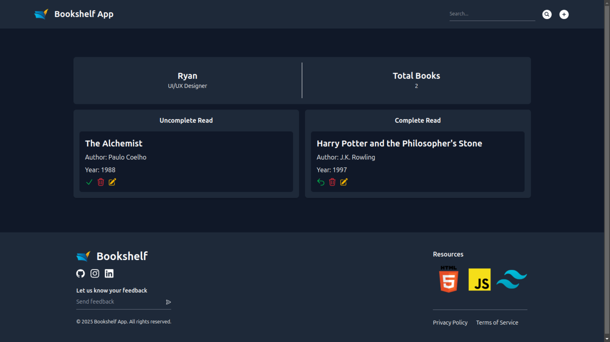

# Bookshelf App Design
# 

## Description
Bookshelf New Design is a web application designed to help users manage their book collections in an intuitive and visually appealing way. The app allows users to add, remove, and categorize books in their collection.

## Features
- **Add Books**: Users can add new books to their collection with details such as title, author, read or uncomplete read, and publication year.
- **Remove Books**: Users can remove books they no longer wish to keep.
- **Edit**: Users can edit books in their collection.
- **Categorization**: Books can be organized by read or unread.
- **Search**: Users can search by title, author, year of publication

## Technologies
- **HTML5**: For the structure of the web pages.
- **Tailwind CSS**: For styling and design of the interface.
- **JavaScript**: For interactivity and data management.
- **Local Storage**: To store book data without an external database.

## Usage
1. Upon opening the application, you will see the main interface.
2. To add a book, fill out the available form and click the "Add Book" button.
3. The added book will appear in your collection.
4. To remove a book, click the "Remove" button next to the book you wish to delete.
5. You can also edit and search for books in the collection.

## Contributing
We welcome contributions! Please fork this repository and create a pull request if you would like to add features or fix bugs.

## Contact
If you have any questions or suggestions, feel free to reach out:

- GitHub: [Ryanz23](https://github.com/Ryanz23)

Feel free to customize the content as needed for your 
project! If you need any changes or additions, just let me know!